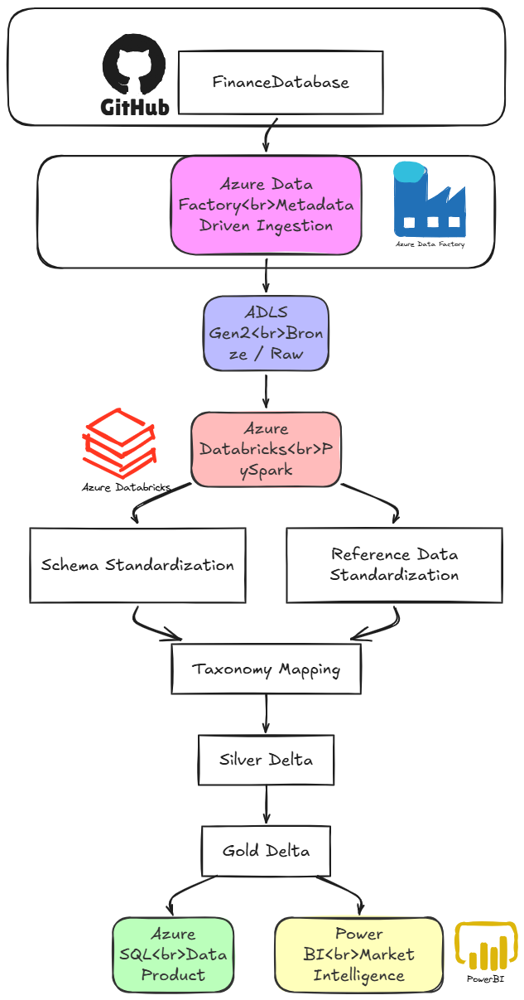

# Global Financial Market Intelligence Hub

An Azure data engineering platform that takes messy, inconsistently-structured financial data — equities, ETFs, and funds sourced from the public [FinanceDatabase](https://github.com/JerBouma/FinanceDatabase) repository — and turns it into one trusted, taxonomy-mapped, quality-scored analytics layer, served through a 5-page Power BI dashboard.

---

## Project Overview

Financial instruments are classified in fundamentally different ways depending on their type. An equity is labeled by *Sector → Industry Group → Industry*. An ETF or fund is labeled by *Family → Category Group → Category*. There's no shared vocabulary between them — which makes a simple cross-market question like *"how much Technology exposure exists across equities, ETFs, and funds combined?"* surprisingly hard to answer directly from the raw data.

This project builds a full Azure data engineering platform that solves that problem end to end: it ingests each dataset in its native shape, standardizes everything into one common instrument model, maps every source-specific classification onto a shared taxonomy with a confidence score, checks the data for quality issues along the way, and serves the result through a dimensional model and an interactive dashboard an analyst can actually explore.

The result is a single, trusted, versioned financial intelligence layer — built with the same ingestion → transformation → serving pattern used in real production data platforms.

**Scope:** Equities, ETFs, and Funds, across 10 exchanges — BER, BSE, FRA, GER, JPX, LSE, NSE, SHZ, VIE, NYQ. Coverage is intentionally uneven where the source data itself is uneven (e.g. NSE only has equity listings, no ETFs or funds) — this is documented, not a defect. This was a deliberate scope decision to fully build and validate the entire pipeline end-to-end, rather than partially cover every asset class the source offers (indices, currencies, cryptocurrencies, money markets were not included).

---

## Architecture



---

## Tech Stack

| Layer | Technology | Role |
|---|---|---|
| Orchestration | Azure Data Factory | Metadata-driven ingestion, scheduling, retries, audit logging |
| Raw storage | ADLS Gen2 (Bronze container) | Immutable source snapshots |
| Transformation | Azure Databricks (PySpark) | Schema standardization, taxonomy mapping, data quality |
| Lakehouse | Delta Lake (Silver + Gold containers) | ACID-compliant, versioned, time-travel capable storage |
| Serving | Azure SQL Database | Star-schema dimensional model for BI consumption |
| Analytics | Power BI | 5-page interactive Market Intelligence Hub |
| Security | Managed Identity + Azure RBAC | No credentials hard-coded anywhere in the pipeline |

---

##  Data Overview

| Metric | Value |
|---|---:|
| Total instruments | 67,213 (Silver) → 66,105 (SQL, post quarantine + dedup) |
| Equities | 40,549 |
| ETFs | 13,782 |
| Funds | 11,774 |
| Exchanges | 10 |
| Countries (instrument HQ, not just exchange location) | ~95 |
| Currencies | 18 |
| Normalized financial themes | 9 |
| Taxonomy mapping rules | 160 (versioned) |

### Data Quality (final, measured)

| Dataset | Total Records | Valid | Quality Score |
|---|---:|---:|---:|
| Equities | 40,549 | 40,174 | 99.08% |
| ETFs | 13,782 | 13,782 | 100% |
| Funds | 11,774 | 11,770 | 99.97% |

### Theme Coverage (top and bottom, out of 100)
Financial Services 92.11 · Consumer 89.58 · Technology 88.63 · ... · Real Estate 82.00 (lowest)

---

## How the Data Moves — Layer by Layer

### 1. Ingestion
A metadata-driven Azure Data Factory pipeline reads an ingestion control table (kept in Azure SQL, not hard-coded), loops over every active source file in parallel, and pulls each one directly from GitHub via HTTP straight into ADLS Gen2's Bronze container. Every load is snapshot-partitioned by date and never overwrites a prior snapshot, so historical reproducibility is built in from day one. Authentication throughout is Managed Identity — no passwords or keys stored anywhere.

### 2. Transformation
Seven Databricks/PySpark notebooks take raw Bronze data and turn it into a trustworthy Silver and Gold layer:
- **Schema standardization** — unifies equities/ETFs/funds into one common instrument model while preserving asset-specific attributes in extension tables
- **Reference data standardization** — canonical country, exchange, and currency dimensions
- **Taxonomy mapping** — a config-driven table (not hard-coded logic) maps each source's own sector/category labels onto 9 normalized financial themes, each with a confidence score and a taxonomy version
- **Data quality framework** — checks completeness, validity, duplicates, and mapping confidence; anything that fails is routed to a quarantine zone instead of silently dropped
- **Gold products** — five business-ready tables, including a custom-built Theme Coverage Score that measures how broadly each theme is represented across asset classes, countries, and exchanges

Delta Lake's versioning is used directly — every Gold table's history can be inspected, and a prior version can be recovered via time travel.

### 3. Serving & Analytics
Gold data is loaded into an Azure SQL star schema (dimensions for country, exchange, currency, asset type, theme, and date, joined to a central instrument fact table), entirely through Azure Data Factory reading Parquet files directly — no additional compute cluster required for this step, keeping the design cost-efficient. Eighteen business views sit on top of the star schema, pre-built to answer the platform's core analytical questions directly. Power BI connects to those views and presents them across five pages: Global Market Overview, Theme Intelligence, Cross-Asset Explorer, Geographic Intelligence, and Data Product Health.

---

## Challenges faced 

Building this surfaced genuine issues that shaped the final design — these were found through actually verifying output, not assumed away:

**1. Bronze was silently full of web pages, not data.**
Every ingested file initially contained a rendered GitHub HTML page instead of real CSV content — the source URL was pointed at GitHub's human-facing `blob` view instead of its raw file endpoint. Caught by inspecting raw file bytes rather than trusting a "successful" pipeline run, fixed by correcting the URL pattern and re-ingesting, then verified with an independent audit comparing the control table against actual Bronze contents.

**2. A silent geography assumption was quarantining a quarter of all equities.**
The country dimension was originally built only from the 10 exchanges' host countries. But an equity's `country` field is actually the company's *headquarters* country — a much broader, largely unrelated set (a stock listed on NYQ can be headquartered anywhere in the world). This mismatch caused 10,875 equities — 27% of the entire equities dataset — to be wrongly flagged as invalid. Rebuilding the country dimension from the real headquarters countries actually present in the data raised the equities quality score from 72.32% to 99.08%.

**3. Azure SQL connections were timing out under Managed Identity.**
The pipeline's connection to Azure SQL failed with a routing timeout that didn't resolve with the usual firewall fixes. The root cause was the SQL Server's connection policy, set to `Default` (which behaves like Redirect and needs a wide range of outbound ports Azure Data Factory's shared runtime can't use). Switching the policy to `Proxy` — a setting no longer exposed in the Portal UI and only reachable via CLI — resolved it immediately.

*(A few smaller issues — a multi-line CSV parsing edge case, a scoring formula normalization bug, and some SQL schema permission gaps — were also found and fixed along the way; documented in full in `docs/data_quality.md` and `docs/pipeline_design.md`.)*

---

## Business Questions This Platform Answers

- Which countries and exchanges have the largest financial instrument universe?
- Which financial themes are represented across the broadest range of asset classes?
- Which themes have strong equity representation but limited ETF/fund coverage?
- What percentage of records map cleanly to the common taxonomy, and where are the gaps?
- How has data quality changed across pipeline runs?

---

## Repository Structure

```
├── architecture/         diagrams and architecture documentation
├── adf/                  Data Factory pipelines, datasets, linked services, metadata
├── databricks/           PySpark notebooks (profiling → standardization → taxonomy → quality → gold)
├── sql/                  DDL, dimension/fact load scripts, indexes, business views
├── powerbi/              market_intelligence.pbix + screenshots
├── docs/                 data dictionary, taxonomy methodology, business rules, data quality, 
                          pipeline design

```

---

## Security

No credentials, keys, or connection strings are stored anywhere in code, notebooks, or pipeline definitions. All service-to-service authentication uses Managed Identity, with access scoped through Azure RBAC role assignments — Storage Blob Data Contributor for pipeline write access, `db_datareader`/`db_datawriter` for SQL load operations, and a separate read-only login dedicated to Power BI, kept intentionally distinct from the pipeline's write-capable identity.

---

